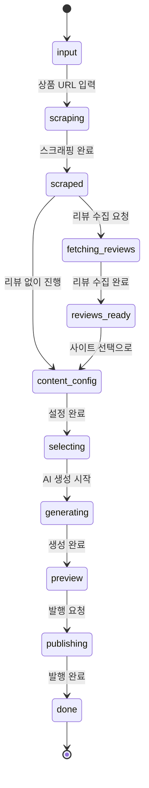

# Content Pipeline

콘텐츠 생성의 전체 워크플로우를 단계별로 설명한다.
프론트엔드에서는 `ContentStep` 타입으로 각 단계를 관리한다.

## 파이프라인 흐름

## 단계별 상세

### 1. Input (입력)
- **컴포넌트**: `ProductInputForm.tsx`
- **사용자 입력**: 상품 URL + 타겟 질문 (1-5개)
- **질문 유형**: recommendation, comparison, review, howto
- 수동 입력 모드: `ManualProductForm.tsx` (스크래핑 실패 시)

### 2. Scraping (스크래핑)
- **API**: `POST /api/content/scrape-product`
- **소스 자동 감지**: URL 패턴으로 소스 결정
- **결과**: `ScrapedProduct` (제목, 가격, 이미지, 스펙, 초기 리뷰)
- **실패 시**: 수동 입력 폼으로 fallback

### 3. Fetching Reviews (리뷰 수집) - 선택
- **API**: `POST /api/content/fetch-reviews`
- **컴포넌트**: `ReviewCollectionPanel.tsx`
- **결과**: `ReviewCollection`
  - 리뷰 배열 (텍스트, 별점, 이미지, 리뷰어, 날짜)
  - 평점 분포 (1-5점)
  - 키워드 테마 (보습, 효과, 자극 등 + 감성)
- **SSE 스트리밍**: 수집 진행률 실시간 표시

### 4. Content Config (콘텐츠 설정)
- **컴포넌트**: `ContentConfigPanel.tsx` + `SiteSelector.tsx`
- **설정 항목**:
  - 발행 대상 사이트 선택 (멀티셀렉트)
  - 사이트별 아티클 수 (1-5개)
  - 사이트 그룹 프리셀렉트 (sessionStorage)
- **결과**: 선택된 사이트 + 아티클 수 목록

### 5. Generating (AI 생성)
- **API**: `POST /api/content/generate-articles`
- **AI**: Google Gemini 2.0 Flash (JSON 응답 모드)
- **병렬 처리**: 3개 동시 생성, 1초 딜레이 후 다음 배치
- **앵글 선택**: 16가지 프레임워크 중 자동 선택
  - 상품: 효과 검증형, 가성비 비교형, 초보자 가이드형, 장단점 비교형, 고민 해결형, 성분 해석형, 리뷰어 사례형, 체크리스트형
  - 맛집: 첫 방문 리뷰, 메뉴 분석, 데이트 코스, 가성비 분석, 베스트 메뉴, 차별화 분석, 가족 가이드, SNS 비교
- **리뷰 윈도우**: 같은 페르소나의 여러 아티클에 리뷰를 분산 배치
- **대표 리뷰**: 최고 평점, 부정적, 이미지 포함, 상세 리뷰 4개 자동 선택
- **SSE 스트리밍**: 아티클별 생성 진행률

### 6. Preview (미리보기)
- **컴포넌트**: `ArticlePreviewList.tsx`
- **표시 항목**: 제목, 발췌, 단어 수, 타겟 질문, 카테고리
- **편집**: 발행 전 미리보기/수정 가능

### 7. Publishing (발행)
- **API**: `POST /api/content/publish-articles`
- **컴포넌트**: `PublishProgress.tsx`
- **과정**:
  1. 리뷰 이미지 다운로드 (curl + iPhone user-agent + referer)
  2. WordPress 미디어 업로드
  3. `<!-- REVIEW_IMG:N:M -->` → 실제 `<figure>` 치환
  4. 카테고리 확인/생성
  5. 태그 생성/머지
  6. FAQ Schema + Article Schema JSON-LD 삽입
  7. Yoast SEO 메타 설정
  8. `POST /wp-json/wp/v2/posts` (status: "publish")
  9. 캐시 워밍 (홈, robots.txt, sitemap, 포스트 URL)
- **SSE 스트리밍**: 사이트별 발행 진행률 + 15초 heartbeat

## 타입 정의

모든 타입은 `admin/src/app/content/types.ts`에 정의:
- `ContentStep`: 파이프라인 단계 유니온 타입
- `ScrapedProduct`: 스크래핑된 상품 데이터
- `ReviewCollection`: 수집된 리뷰 데이터
- `GeneratedArticle`: AI 생성된 아티클
- `SiteCredential`: 사이트 인증 정보
- `TargetQuestion`: 타겟 질문 (text + intent)
- `ProductReview`: 개별 리뷰
- `ContentArticleConfig`: 사이트별 아티클 수 설정

---
## 변경 이력
| 날짜 | 작성자 | 도구 | 변경 내용 |
|------|--------|------|-----------|
| 2026-03-10 | - | Claude Code | 콘텐츠 파이프라인 문서 초안 작성 |
