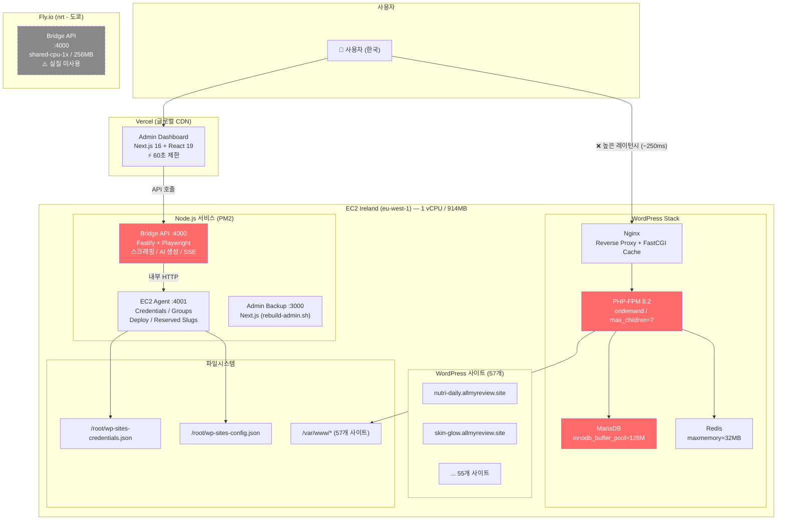
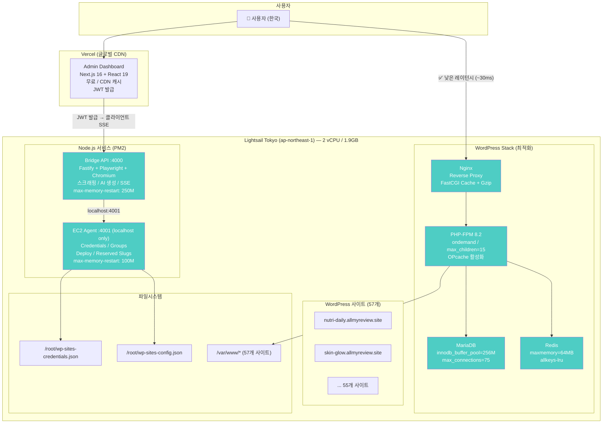
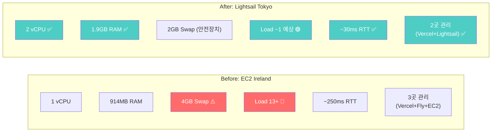
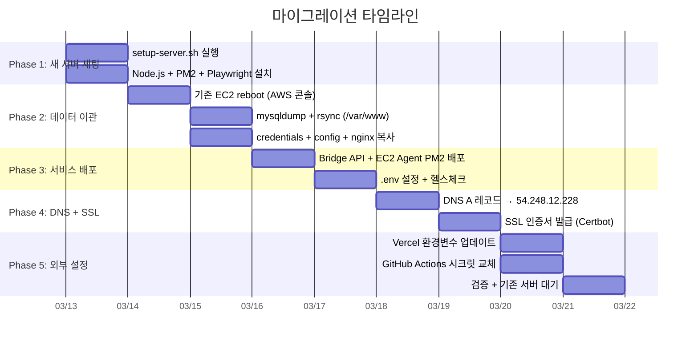
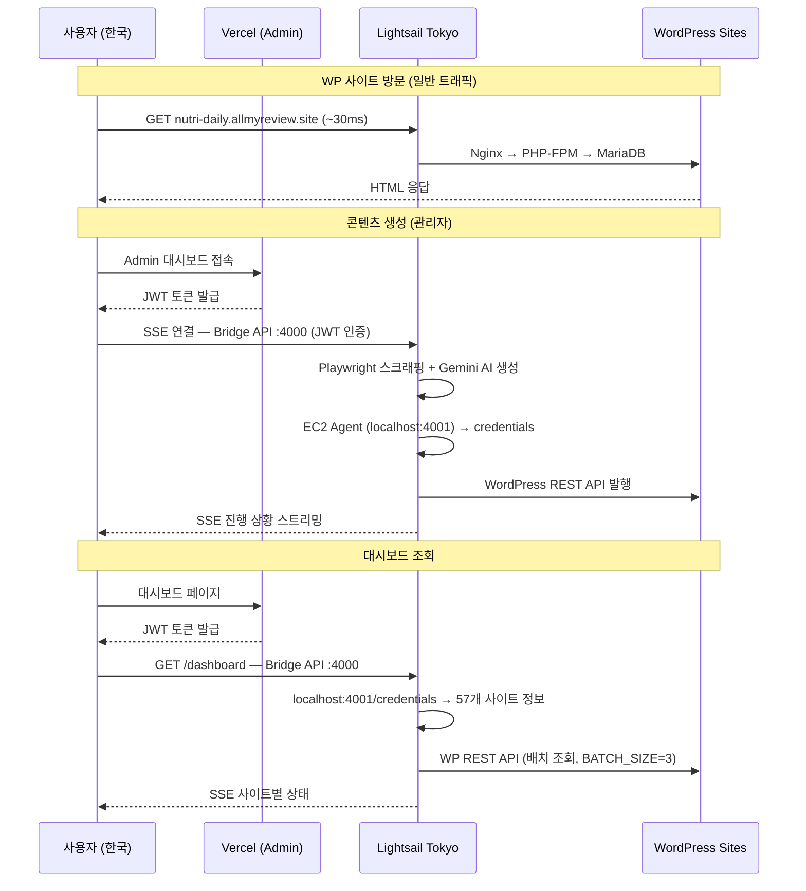

# 인프라 마이그레이션 전략

## Ireland EC2 → Tokyo Lightsail (통합)

---

## 1. Before: 현재 아키텍처 (단일 EC2)



### 현재 문제점

| 문제 | 원인 | 영향 |
|------|------|------|
| **서버 과부하** (load 13+) | 1 vCPU / 914MB에 모든 서비스 집중 | SSH 불가, 사이트 다운 |
| **IO wait 83%** | RAM 부족 → swap thrashing (580MB) | 전체 성능 저하 |
| **높은 레이턴시** | Ireland 리전 (한국→아일랜드 ~250ms RTT) | WP 사이트 느림 |
| **단일 장애점** | 모든 서비스가 하나의 EC2 | 하나 죽으면 전부 다운 |
| **Fly.io 비활용** | Bridge API가 EC2에서 직접 실행 | 비용 낭비 |
| **Playwright 경합** | Chromium + WP가 같은 서버 메모리 공유 | 스크래핑 시 WP 성능 저하 |

---

## 2. After: 새 아키텍처 (Lightsail 통합)



---

## 3. 서비스 배치 결정 근거

### Lightsail Tokyo (전체 통합)

| 결정 | 이유 |
|------|------|
| **WP 57개 사이트** | 트래픽 주력 → 한국 가까운 도쿄 배치 (RTT ~30ms) |
| **Bridge API 통합** | 간헐적 사용 (하루 몇 번), 1.9GB면 WP와 공존 가능 |
| **EC2 Agent 통합** | credentials/config 파일 로컬 접근 + deploy 스크립트 실행 |
| **Admin Dashboard 제거** | Vercel Free로 충분, 서버 리소스 절약 |
| **Fly.io 제거** | 인프라 단순화 (2곳만 관리), 비용 절감 |

### 통합이 가능한 이유

| 근거 | 설명 |
|------|------|
| **Bridge API는 상시 실행 아님** | 관리자가 콘텐츠 생성할 때만 호출 (하루 몇 번) |
| **Playwright idle 시 ~50MB** | 실행 중일 때만 200MB+, 대부분 유휴 상태 |
| **PM2 max-memory-restart** | Bridge API 250M 제한 → Chromium 폭주해도 자동 재시작 |
| **localhost 통신** | Bridge↔Agent 간 네트워크 오버헤드 제거 |
| **디버깅 단순화** | `pm2 logs`로 전체 서비스 한 번에 확인 |

### Vercel (Admin Dashboard)

| 결정 | 이유 |
|------|------|
| **변경 없음** | 글로벌 CDN, 무료, 자동 배포 |
| **JWT 발급** | Vercel에서 JWT 발급 → 클라이언트가 Lightsail Bridge에 직접 SSE 연결 |

---

## 4. 리소스 비교 (Before vs After)



### Lightsail 튜닝값 (1.9GB RAM 기준)

| 컴포넌트 | 기존값 | 새 값 | 근거 |
|----------|--------|-------|------|
| PHP-FPM max_children | 7 | **15** | ~40MB × 15 = 600MB |
| MariaDB buffer_pool | 128M | **256M** | RAM 비례 증가 |
| MariaDB log_file_size | 32M | **48M** | buffer_pool 비례 |
| MariaDB max_connections | 50 | **75** | WP 동시 접속 대응 |
| Redis maxmemory | 32MB | **64MB** | 57개 사이트 오브젝트 캐시 |
| Nginx worker_connections | 512 | **1024** | 2 vCPU 대응 |
| Swap | 4GB | **2GB** | RAM 충분, 비상용만 |
| Bridge API max-memory | - | **250M** | Playwright 폭주 방지 |
| EC2 Agent max-memory | 100M | **100M** | 변경 불필요 |

### 예상 메모리 사용량

```
PHP-FPM:         ~600MB (peak)
MariaDB:         ~350MB
Bridge API:      ~200MB (Playwright 실행 중) / ~50MB (idle)
EC2 Agent:       ~100MB
Redis:            ~64MB
Nginx:            ~30MB
OS:              ~200MB
─────────────────────────────────
합계 (peak):   ~1,544MB / 1,900MB (여유 ~356MB + Swap 2GB)
합계 (idle):   ~1,294MB / 1,900MB (여유 ~606MB)
```

---

## 5. 마이그레이션 Phase별 계획



### Phase 1: 새 서버 기본 세팅

```bash
# 수정된 setup-server.sh 업로드 후 실행
scp -i lightsail-key.pem scripts/setup-server.sh ubuntu@54.248.12.228:~/
ssh -i lightsail-key.pem ubuntu@54.248.12.228 "sudo bash ~/setup-server.sh"

# Node.js 20 + PM2 + Playwright
curl -fsSL https://deb.nodesource.com/setup_20.x | sudo bash -
sudo apt-get install -y nodejs
sudo npm install -g pm2
pm2 startup
sudo npx playwright install-deps chromium
npx playwright install chromium
```

### Phase 2: 데이터 이관 (기존 EC2 reboot 후)

```bash
# 기존 서버에서 dump
ssh -i wp-bulk-generator.pem ubuntu@108.129.225.228
sudo mysqldump -u root -p"$(sudo cat /root/.wp-bulk-credentials | cut -d= -f2)" \
  --all-databases --single-transaction > ~/all-databases.sql
sudo tar czf ~/var-www.tar.gz /var/www/
sudo tar czf ~/nginx-sites.tar.gz /etc/nginx/sites-available/ /etc/nginx/sites-enabled/
sudo cp /root/wp-sites-credentials.json /root/wp-sites-config.json /root/.wp-bulk-credentials ~/

# 새 서버로 전송 (로컬 릴레이)
scp -i wp-bulk-generator.pem ubuntu@108.129.225.228:~/all-databases.sql .
scp -i lightsail-key.pem all-databases.sql ubuntu@54.248.12.228:~/
# (var-www.tar.gz, nginx-sites.tar.gz, credentials 동일)

# 새 서버에서 복원
sudo mysql -u root -p"..." < ~/all-databases.sql
sudo tar xzf ~/var-www.tar.gz -C /
sudo chown -R www-data:www-data /var/www/
sudo tar xzf ~/nginx-sites.tar.gz -C /
sudo cp ~/wp-sites-credentials.json ~/wp-sites-config.json /root/
sudo cp ~/.wp-bulk-credentials /root/ && sudo chmod 600 /root/.wp-bulk-credentials
sudo nginx -t && sudo systemctl reload nginx
```

### Phase 3: 서비스 배포

```bash
# Repo clone + build
git clone <repo> /home/ubuntu/wp-bulk-generator
cd /home/ubuntu/wp-bulk-generator/bridge-api
npm ci --production && npm run build

# .env 설정 (EC2_AGENT_URL=http://127.0.0.1:4001 — 같은 서버!)
# PM2 시작
pm2 start dist/ec2-agent.js --name ec2-agent \
  --cwd /home/ubuntu/wp-bulk-generator/bridge-api \
  --max-memory-restart 100M

pm2 start dist/server.js --name wp-bridge-api \
  --cwd /home/ubuntu/wp-bulk-generator/bridge-api \
  --max-memory-restart 250M

pm2 save
```

### Phase 4: DNS 전환 + SSL

```bash
# DNS: *.allmyreview.site A 레코드 → 54.248.12.228
# (TTL을 미리 60초로 낮춰두기)

# SSL 발급
sudo certbot --nginx --non-interactive --cert-name allmyreview-sites \
  -d site1.allmyreview.site -d site2.allmyreview.site ...
sudo nginx -t && sudo systemctl reload nginx
```

### Phase 5: Vercel + GitHub Actions

```bash
# Vercel 환경변수 업데이트
# BRIDGE_API_URL → http://54.248.12.228:4000
# NEXT_PUBLIC_BRIDGE_URL → http://54.248.12.228:4000

# GitHub Actions 시크릿 업데이트
# SSH_HOST → 54.248.12.228
# SSH_PRIVATE_KEY → Lightsail PEM
```

---

## 6. 네트워크 흐름 (After)



---

## 7. 변경이 필요한 설정 파일

| 파일 | 변경 내용 |
|------|-----------|
| `scripts/setup-server.sh` | 7개 튜닝값 수정 + UFW 4000 포트 추가 |
| `.github/workflows/deploy-bridge.yml` | Bridge API PM2 배포 추가 |
| `.github/workflows/deploy-fly.yml` | 비활성화 (Fly.io 미사용) |
| `bridge-api/.env` (서버) | `EC2_AGENT_URL=http://127.0.0.1:4001` |
| Vercel 환경변수 | `BRIDGE_API_URL`, `NEXT_PUBLIC_BRIDGE_URL` → 새 IP |
| GitHub Actions 시크릿 | `SSH_HOST`, `SSH_PRIVATE_KEY` → Lightsail |
| DNS (allmyreview.site) | A 레코드 → 54.248.12.228 |

---

## 8. 롤백 계획

기존 EC2는 즉시 삭제하지 않고 **1주일간 유지**

```
문제 발생 시:
1. DNS를 기존 EC2 IP (108.129.225.228)로 복구 (TTL 60초)
2. Vercel/GitHub 환경변수를 기존 값으로 복원
3. 기존 서버 PM2 서비스 재시작
4. 원인 분석 후 재이관
```

---

## 변경 이력
| 날짜 | 작성자 | 도구 | 변경 내용 |
|------|--------|------|-----------|
| 2026-03-13 | Kevin | Claude Code | 인프라 마이그레이션 전략 문서 초안 작성 |
| 2026-03-13 | Kevin | Claude Code | Fly.io 분리 → Lightsail 통합 아키텍처로 전면 수정 |
