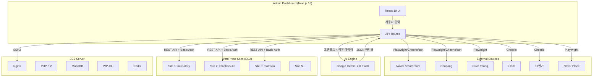
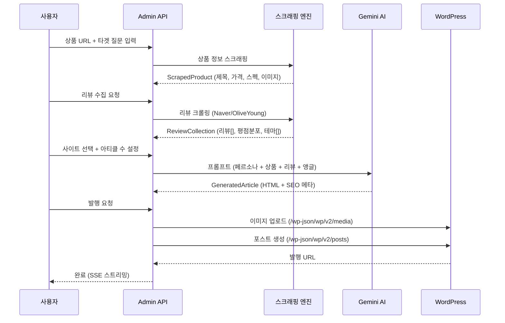

# System Overview

## 프로젝트 개요

WP Bulk Generator는 WordPress 사이트를 대량 생성하고, AI 기반 콘텐츠를 자동으로 생성·발행하는 도구이다.
건강기능식품/영양제 리뷰 블로그 사이트를 주요 타겟으로 하며, 맛집 리뷰 등 다양한 니치로 확장 가능하다.

## 시스템 아키텍처

## 기술 스택

| 계층 | 기술 | 용도 |
|------|------|------|
| **Frontend** | Next.js 16, React 19, TypeScript | 관리 대시보드 UI |
| **Styling** | Tailwind CSS 4 | 다크 테마 UI |
| **AI** | Google Gemini 2.0 Flash | 아티클 생성, 사이트 설정 생성 |
| **스크래핑** | Playwright 1.58 + Stealth | JS 렌더링 사이트 (Olive Young, Naver Place) |
| **파싱** | Cheerio 1.2 | 정적 HTML 파싱 (Naver, Coupang, iHerb) |
| **서버 연결** | SSH2 1.17 | EC2 원격 명령 실행 |
| **WordPress** | REST API + Basic Auth | 콘텐츠 발행, 미디어 업로드 |
| **서버** | Nginx + PHP 8.2 + MariaDB | WordPress 호스팅 |
| **캐시** | Redis | WordPress 오브젝트 캐시 |

## 핵심 데이터 흐름

## 핵심 아키텍처 패턴

### 1. SSE 스트리밍
모든 장시간 작업(스크래핑, AI 생성, 발행, 배포)은 Server-Sent Events로 실시간 진행률 전송.
- 15초 간격 heartbeat로 연결 타임아웃 방지
- `text/event-stream` Content-Type
- `ReadableStream` + `TextEncoder` 패턴

### 2. 배치 처리 + Rate Limit 대응
- AI 생성: 3개 병렬 → 1초 딜레이 → 다음 배치
- 429 에러: 5회 재시도, 지수 백오프 (30/60/120/180초)
- 리뷰 수집: 페이지별 순차 (300-500ms 딜레이)

### 3. Multi-Fallback 스크래핑
각 소스에 대해 다단계 fallback 전략:
1. curl (가장 빠름, 봇 차단 가능)
2. fetch with mobile user-agent
3. Playwright (JS 렌더링 필요 시)
4. 수동 입력 (모든 방법 실패 시)

### 4. 페르소나 기반 콘텐츠
- 사이트마다 고유 페르소나 (이름, 나이, 관심사, 전문성, 톤, 바이오)
- 같은 상품이라도 페르소나별 다른 관점의 아티클 생성
- 8개 상품 앵글 + 8개 맛집 앵글 = 16가지 콘텐츠 프레임워크

### 5. Local vs EC2 모드
- `isLocalDevMode()`: 환경에 따라 SSH 원격 실행 또는 직접 실행 분기
- 로컬 개발: SSH2로 원격 서버에 명령 전송
- 서버 실행: 직접 스크립트 실행 (SSH 불필요)

---
## 변경 이력
| 날짜 | 작성자 | 도구 | 변경 내용 |
|------|--------|------|-----------|
| 2026-03-10 | - | Claude Code | 시스템 개요 초안 작성 |
