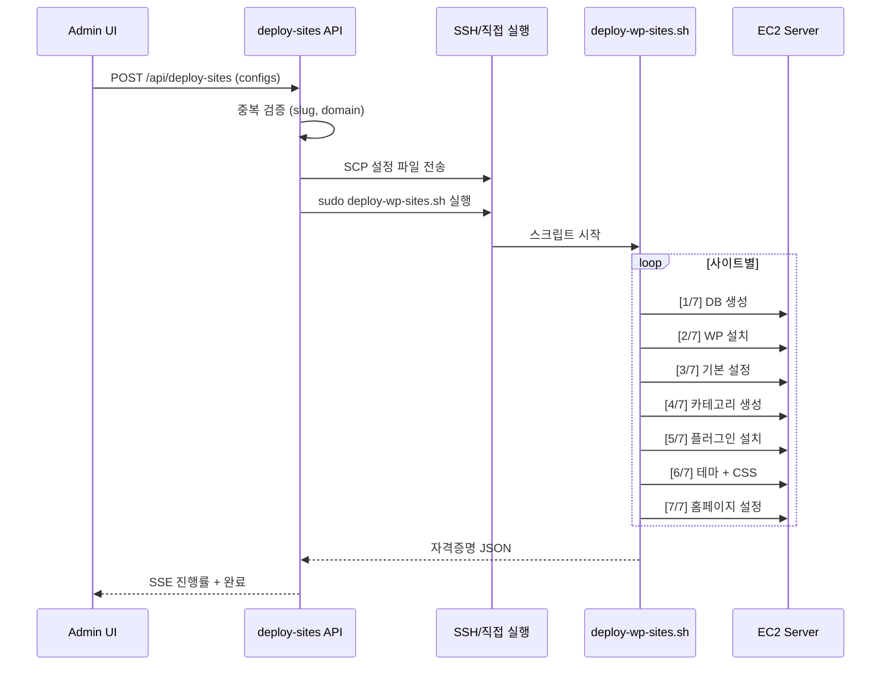

# Site Deployment Guide

WordPress 사이트 일괄 배포 워크플로우를 설명한다.

## 배포 흐름



---

## 입력 설정

**파일**: `configs/sites-config.json`

```json
[
  {
    "site_slug": "nutri-daily",
    "domain": "nutri-daily.site",
    "site_title": "뉴트리데일리",
    "tagline": "30대 직장인의 영양제 루틴 기록",
    "color_scheme": { "primary": "#2D6A4F", "secondary": "#D8F3DC", "accent": "#40916C" },
    "persona": { "name": "하준", "age": 33, "concern": "만성피로", "expertise": "중급", "tone": "담백", "bio": "..." },
    "categories": ["비타민", "미네랄", "피로회복"],
    "initial_post_topics": ["영양제 입문 가이드"]
  }
]
```

---

## 사이트별 설치 단계

### [1/7] Database 생성
- DB명: `wp_{site_slug}` (16자 제한)
- 사용자: `wp_{site_slug}` (16자 제한)
- 비밀번호: 랜덤 생성
- Character set: `utf8mb4_unicode_ci`

### [2/7] WordPress Core 설치
```bash
wp core download --path=/var/www/{slug} --locale=ko_KR --force
wp config create --dbname=... --dbuser=... --dbpass=...
wp config set WP_REDIS_HOST 127.0.0.1
wp config set WP_REDIS_DATABASE $i    # 사이트별 Redis DB 번호
wp config set WP_CACHE true --raw
wp config set DISABLE_WP_CRON true --raw
wp core install --url=https://{domain} --title="{title}" --admin_user=admin
```

### [3/7] 기본 설정
- 블로그 설명 (tagline)
- 퍼머링크: `/%postname%/`
- 시간대: `Asia/Seoul`
- 검색엔진 노출: 허용 (`blog_public 1`)

### [4/7] 카테고리 생성
- config의 `categories` 배열에서 생성
- 기본 "Uncategorized" 삭제

### [5/7] 플러그인 설치
| 플러그인 | 용도 |
|----------|------|
| wordpress-seo (Yoast) | SEO 관리 |
| redis-cache | Redis 오브젝트 캐시 |
| wp-fastest-cache | 추가 캐싱 |
| redirection | URL 리다이렉션 |

### [5.5/7] robots.txt + Sitemap
- robots.txt 생성 (AI 크롤러 허용)
- 권한: `www-data:www-data`

### [6/7] 테마 + Custom CSS
- 기본 테마: twentytwentyfour
- color_scheme으로 CSS Custom Properties 생성:
```css
:root {
  --wp-primary: #2D6A4F;
  --wp-secondary: #D8F3DC;
  --wp-accent: #40916C;
}
```

### [7/7] 홈페이지 설정
- "About" 페이지 생성 (페르소나 bio 기반)

---

## Nginx 설정 (자동 생성)

각 사이트에 대해 Nginx 설정이 자동 생성된다.

### 주요 설정
- HTTP → HTTPS 리다이렉트
- FastCGI 캐시 (60분, POST/wp-admin/로그인 제외)
- 보안 헤더: X-Content-Type-Options, X-Frame-Options, Referrer-Policy
- 정적 자산 30일 캐시
- 민감 파일 차단: `.htaccess`, `wp-config.php`, `readme.html`, `license.txt`

### SSL 인증서
- `*.allmyreview.site` 도메인: 공유 와일드카드 인증서
- 기타 도메인: Certbot 개별 발급
- SAN 제한: 인증서당 95개 도메인

---

## MU-Plugins (자동 설치)

### enable-app-passwords.php
```php
add_filter('wp_is_application_passwords_available', '__return_true');
add_filter('wp_is_application_passwords_available_for_user', '__return_true');
```
HTTP에서도 REST API 인증을 위한 앱 패스워드 사용 가능.

### ai-seo-optimize.php
- Canonical URL 삽입
- 빈 검색/아카이브 noindex
- 메타 설명 fallback
- Open Graph fallback

---

## 시스템 Cron

**파일**: `/usr/local/bin/wp-bulk-run-cron.sh` (자동 생성)

```bash
for site_dir in /var/www/*; do
  [ -d "$site_dir" ] || continue
  [ -f "$site_dir/wp-config.php" ] || continue
  timeout 15 wp cron event run --due-now --path="$site_dir" --allow-root
done
```

실행 주기: 5분마다 (`/etc/cron.d/wp-bulk-run-cron`)

---

## 자격증명 관리

### 서버 측
- `/root/wp-sites-credentials.json` — 전체 사이트 인증 정보
- 사이트별: slug, domain, title, admin_user, admin_pass, app_pass, db_name, db_user, db_pass

### 클라이언트 측
- `admin/.cache/sites-credentials.json` — 런타임 캐시 (git 제외)
- 배포 완료 후 API가 자동 동기화

---

## 재개 가능 배포

- 기존 credentials 파일 확인
- `wp core is-installed`로 설치 여부 확인
- 이미 설치된 사이트는 skip
- 새 사이트만 추가 설치 후 credentials에 append

---

## 실행 모드

### Local Dev Mode
```
Admin UI → API → SSH2 → EC2 서버
```
- `SSH_KEY_PATH` 환경변수 설정 시 활성화
- SCP로 설정 파일 전송 → SSH로 스크립트 실행

### EC2 Server Mode
```
Admin UI → API → 직접 실행
```
- EC2에서 직접 Next.js 실행 시
- SSH 없이 직접 스크립트 실행

---

## API 엔드포인트

**POST /api/deploy-sites**
- **파일**: `admin/src/app/api/deploy-sites/route.ts`
- **maxDuration**: 600초 (10분)
- **검증**: 중복 slug/domain 체크, 기존 사이트 충돌 방지

### SSE 이벤트
```json
{ "message": "설정 파일 준비 중..." }
{ "progress": 3, "total": 5, "currentSite": "nutri-daily" }
{ "status": "done", "credentials": { "admin_user": "admin", "sites": [...] } }
```

---

## 시간 예상

| 작업 | 소요 시간 |
|------|-----------|
| 서버 초기화 (setup-server.sh) | ~10-15분 |
| 단일 사이트 배포 | ~3-5분 |
| 10개 사이트 배포 | ~30-50분 |

---
## 변경 이력
| 날짜 | 작성자 | 도구 | 변경 내용 |
|------|--------|------|-----------|
| 2026-03-10 | - | Claude Code | 사이트 배포 가이드 초안 작성 |
